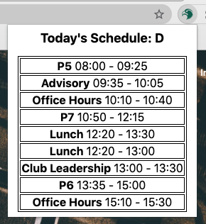

# Harker Bell Schedule Extension
A tiny chrome extension that shows you your day's schedule.

How the extension looks as of now: \

## Features
* 100% up-to-date and reliable
* Allows custom period names
* Shows special and modified schedules
* Opens in popup
* No private data access

## Installation
1. Download the [latest release](https://github.com/gadhagod/bell-schedule-extension/releases/latest) as a ZIP and unzip.
2. Navigate to [chrome://extensions](chrome://extensions).
3. Activate developer mode from the top right of the screen.
4. Click <kbd>load unpacked</kbd> on the top left of the page.
5. Select the unzipped extension folder.
6. Optionally pin the extension for quick access.

***

To be done:
* Add time left in current period.
* Make days where there are no schedule visually pleasing.
* Notify users when a new version is released.